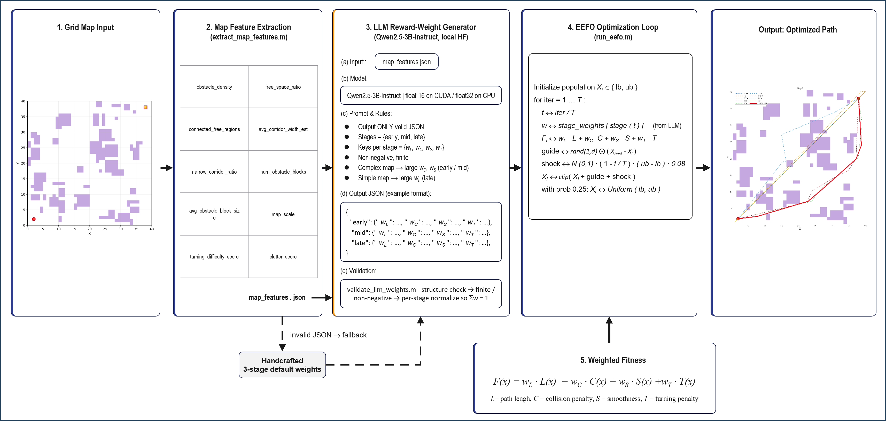

# EEFOLLM

**EEFOLLM** is a method for path planning on grid maps. It runs inside the **EEFO** search loop ([`matlab/algorithms/run_eefo.m`](matlab/algorithms/run_eefo.m)) and uses a **large language model** to generate **stage-wise sub-objective weights** (early / mid / late) for a single **scalar fitness** with four weighted terms (path length, collision / safety, smoothness, turning; see `matlab/fitness/` and `cfg.weights` in [`matlab/config/default_config.m`](matlab/config/default_config.m)). The method is implemented in [`matlab/algorithms/run_llm_eefo.m`](matlab/algorithms/run_llm_eefo.m) (registered name **EEFOLLM**). This repository has **MATLAB** code in [`matlab/`](matlab/) and a **Python** weight pipeline in [`llm/`](llm/). Qwen weights are **not** shipped with the repo; configure them as below.

> Licensed under [MIT](LICENSE). Qwen, PyTorch, and other third parties keep their own licenses.

---

## Framework

<p align="center">
  
</p>

---

## Method and contributions

### Method

| Piece | In this repo |
|--------|----------------|
| **Encoding** | **K** waypoints → dimension **2K** (`cfg.path.default_k` in `default_config.m`) |
| **Fitness** | One scalar per generation from four terms; **early / mid / late** can use different weights. **EEFOLLM** gets weights from an **LLM** using **map features** in Python, then validates and applies them in MATLAB ([`llm/generate_qwen_weights.py`](llm/generate_qwen_weights.py)). |
| **Optimizer** | `run_llm_eefo` uses the same EEFO update as `run_eefo`, with `use_stage_weights` and LLM `stage_weights`. |

### Contributions

1. **Map-conditioned stage weights** — The LLM maps task / map features to **three** weight sets (early, mid, late), reshaping one scalar fitness through the run instead of a single static set or a fully hand-tuned table.  
2. **End-to-end integration** — Those weights plug into the existing `run_eefo` loop on a **unified path encoding** under **grid and collision** constraints, so language-derived priors and path search share one **reproducible** script path.

---

## Reproducing the default experiment

The entry point [`matlab/run_experiment.m`](matlab/run_experiment.m) calls [`matlab/run_global_experiments_batch1.m`](matlab/run_global_experiments_batch1.m). By default, [`default_config.m`](matlab/config/default_config.m) fixes:

| Setting | Code default (check file for your checkout) |
|---------|-----------------------------------------------|
| Maps | `cfg.maps.names` → **5** benchmark maps |
| Repeats | `cfg.exp.runs_per_map` → **20** runs per map and algorithm |
| Methods | `cfg.exp.algorithms_batch1` → **10** entries (EEFOLLM + comparators) |
| Cache | If `results/global_experiments_batch1/mat/global_results.mat` exists, the run may **reload** it unless you force a rerun (below). |

**Steps**

1. In MATLAB, set the current folder to the **repository root** (folder that contains `matlab/`, `llm/`, `maps/`).  
2. Run:

   ```matlab
   addpath('matlab');
   run_experiment
   ```

   `addpath('matlab')` exposes `matlab/run_experiment.m`; the code then calls `init_paths` and loads `default_config` as in the sources above.

3. **Force a full recompute** (ignore cached `global_results.mat`): `run_experiment(true)`, *or* set `cfg.rerun_global_experiments = true` in `default_config.m`, *or* delete `results/global_experiments_batch1/mat/global_results.mat` and run again.

4. **LLM mode** — In `default_config.m`, `cfg.use_real_qwen` defaults to **`true`** (calls Python + Qwen for EEFOLLM weights). For a **quick pipeline check** without a local model, set it to **`false`** to use the mock weight generator (still writes outputs; EEFOLLM uses mock-based weights).

**Where outputs go** (not tracked in Git: see `.gitignore`)

| Path | Content |
|------|--------|
| `results/global_experiments_batch1/` | `mat/`, `tables/`, `features/`, `weights/`, … |
| `figures/global_experiments_batch1/` | Plots and exports |
| `logs/` | Log files |

In `tables/records.csv` and figures, use rows or series with **`Algorithm` = `EEFOLLM`** for the proposed method.

---

## LLM setup (real Qwen)

- **Model:** [Qwen2.5-3B-Instruct](https://huggingface.co/Qwen/Qwen2.5-3B-Instruct) (optional mirror: [ModelScope](https://www.modelscope.cn/models/qwen/Qwen2.5-3B-Instruct))  
- **Local path** — `cfg.llm.local_model_dir` in `default_config.m`  

  Example download (from repo root; use `llm/...` on macOS/Linux):

  ```text
  python -m pip install -U huggingface_hub hf_xet
  python llm/download_qwen_model.py --repo Qwen/Qwen2.5-3B-Instruct --out llm/models/Qwen2.5-3B-Instruct-full
  ```

- Prefer a **`.venv`** in the repo root: if `.\.venv\Scripts\python.exe` (Windows) exists, `default_config` uses it. Install `pip install -r requirements-llm.txt` and a suitable **PyTorch** build. See [`setup_venv_e.ps1`](setup_venv_e.ps1) for a Windows + CUDA example.  
- Weights are clipped in Python, then revalidated / renormalized per stage in MATLAB.

---

## Repository layout

| Path | Role |
|------|------|
| `matlab/` | `run_experiment.m`, `config/`, `algorithms/`, `fitness/`, `llm_bridge/`, … |
| `llm/` | Python scripts, prompts, `io/` runtime files (models not in Git: `llm/models/README.txt`) |
| `maps/` | Fixed benchmark maps |
| `docs/images/` | Framework figure |
| `scripts/` | Optional helpers (packaging, extra plots); not required for `run_experiment` |

---

## Citation

Please cite the **Qwen** model and its technical report, the **EEFO** work as you rely on it, and your own paper or artifact for this project.
